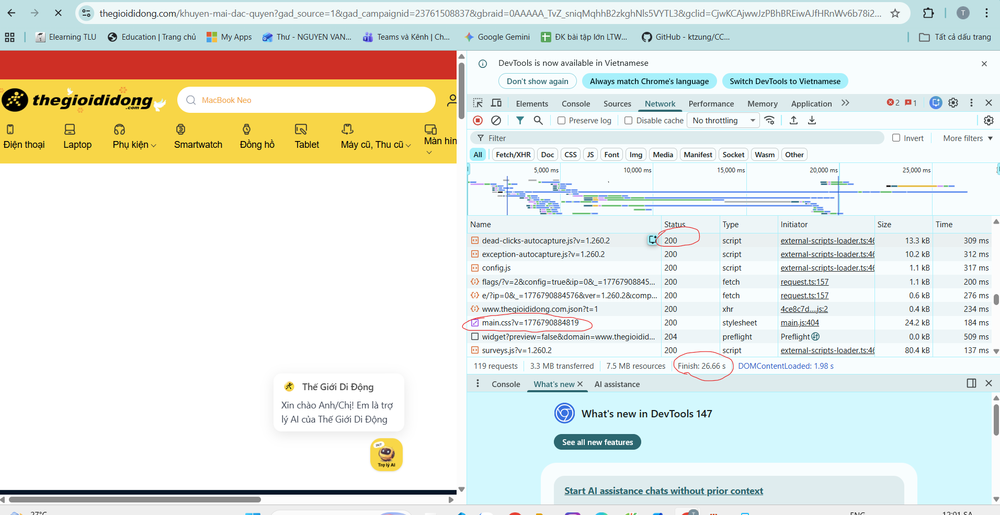

Phần A:
    Câu A1(5đ) — HTTP & Browser

        Câu 1:5 Bước Chính từ DNS Lookup đến Render:
            Bước 1: DNS Lookup
                Trình duyệt chuyển đổi domain shopee.vn thành IP address của server thực tế
                Nguồn: tuan_1_html5/01_introduction_html_universe.md - Phần "1.2. HTTP — Ngôn  ngữ để Client và Server hiểu nhau" (liên quan đến kiến trúc Client-Server)
            Bước 2:Kết nối mạng & Gửi HTTP Request
                Request của bạn xuất phát từ laptop → qua router WiFi → qua ISP (nhà mạng) → chạy qua cáp quang xuyên đất → đến Data Center của Shopee
                Nguồn: tuan_1_html5/01_introduction_html_universe.md - Phần "Cuộc Hành Trình 0.3 Giây Xuyên Đại Dương":
            Bước 3:Server Xử lý & Gửi Response
                Server nhận request, xử lý logic (query database, chuẩn bị dữ liệu) → gửi trả file HTML, CSS, JavaScript
                Nguồn: tuan_1_html5/01_introduction_html_universe.md - 
            Bước 4:Browser Parse HTML/CSS/JS
                Chrome nhận file từ server
                Parse HTML: Đọc cấu trúc DOM (các phần tử, tags)
                Parse CSS: Đọc styling (màu sắc, bố cục, font)
                Execute JavaScript: Chạy logic tương tác
                Nguồn: tuan_1_html5/01_introduction_html_universe.md - Phần "1.3. Browser Rendering":
            Bước 5:Paint & Render (Hiển thị Giao diện)
                Browser vẽ trang web lên màn hình → Bạn thấy trang Shopee
                Nguồn: tuan_1_html5/01_introduction_html_universe.md - Phần "1.3. Browser Rendering":
    Câu 2:
        Các thông tin chính:
        Danh sách Requests - Tất cả HTTP requests được gửi:
            HTML files, CSS files, JS files
            Hình ảnh, fonts, media
            API calls (fetch requests)
        Response Status & Code:
            200 OK - Thành công
            404 Not Found - File không tìm thấy
            500 Server Error - Lỗi server
            Nguồn:(Theo tuan_1_html5/01_introduction_html_universe.md - phần HTTP Response Codes)
        Headers (Request & Response):
            Content-Type, User-Agent
            Authorization tokens
            Cache control info
            Response Body
        Data trả về từ server (JSON, HTML, CSS, etc.):
            Waterfall & Timing
            DNS Lookup time
            Connection time
            Request time
            Response time
            Nguồn:(Liên quan đến khái niệm "0.3 giây" trong tuan_1_html5/01_introduction_html_universe.md
            
    Câu A2:
        Google Dùng AI/Bot Để "Đọc" Trang Web
        Google bot không nhìn trang web như con người
        Nó chỉ đọc HTML code để hiểu nội dung
        Nếu code dùng 
 ở khắp nơi → Bot không biết phần nào là gì.
        4 lỗi semantic:
        Lỗi 1: Dùng `
` thay vì `<header>`
        Trước 
        

            
ShopTLU

        

        Sau 
        <header>
            
ShopTLU

        </header>

        ---
        Lỗi 2: Dùng `
` thay vì `<nav>` cho menu
        Trước 
        

            
<a href="/">Trang chủ</a>

            
<a href="/products">Sản phẩm</a>

        

        Sau 
        <nav>
            <ul>
                <li><a href="/">Trang chủ</a></li>
                <li><a href="/products">Sản phẩm</a></li>
            </ul>
        </nav>
        ---
        Lỗi 3: Dùng `
` thay vì `<main>`
        Trước 
        

            
...

        

        Sau 
        <main>
            <article class="product">...</article>
        </main>

        ---
        Lỗi 4: Dùng `
` thay vì `<article>`
        Trước
        

            
iPhone 16 Pro

            
25.990.000đ

            

        

        Sau 
        <article class="product">
            <h2>iPhone 16 Pro</h2>
            
25.990.000đ

            <figure>
                
                <figcaption>iPhone 16 Pro</figcaption>
            </figure>
        </article>
    Câu A3:
        
Hộp 1
	Kiểu:Block   
       -> Xuống dòng mới → chiếm cả dòng
        Text A	Kiểu:Inline	
       -> Nằm trên cùng dòng với phần tử inline kế tiếp
        Text B	Kiểu:Inline	
       -> Nằm cạnh Text A (cùng dòng)
        
Hộp 2
	Kiểu:Block	
       -> Xuống dòng mới → chiếm cả dòng
        Text C	Kiểu:Inline	
        ->Nằm trên cùng dòng với Text D
        <strong>Text D</strong>	Kiểu:Inline	
        ->Nằm cạnh Text C (cùng dòng)
        
Hộp 3
	Kiểu:Block	
        ->Xuống dòng mới → chiếm cả dòng.
    Câu A4:

        Sự khác nhau cơ bản:
        Element	    Vai Trò 	    Nội Dung	            Hiển Thị
        <thead>	    Đầu bảng	    Tiêu đề cột (header)	In đậm, nền xám
        <tbody>	    Thân bảng	    Dữ liệu chính	        Text bình thường
        <tfoot>	    Chân bảng	    Tổng kết, summary	    Có thể highlight
        Tại sao KHÔNG NÊN dùng table để tạo layout trang web?
            Lỗi 1: SEO Bị Suy Giảm Nghiêm Trọng
            Vấn đề:
                Table được thiết kế cho dữ liệu dạng bảng, không phải layout
                Google bot đọc table từ trái → phải, trên → dưới
                Nếu dùng table làm layout → nội dung bị xáo trộn khi bot đọc.
            Lỗi 2: Trang Web KHÔNG Responsive (Mobile Unfriendly)
            Vấn đề:
                Table có chiều rộng cố định từ thuộc tính width
                Trên mobile, table không thể scale down → user phải cuộn ngang
                CSS Grid/Flexbox có thể responsive dễ dàng    
            Lỗi 3: Code HTML Phức Tạp & Khó Bảo Trì
            Vấn đề:
                Table layout cần nhiều nested <tr><td> để tạo layout
                Mỗi khi thay đổi design → phải sửa cả HTML lẫn CSS
                Dễ gây lỗi alignment khi update.
                    
